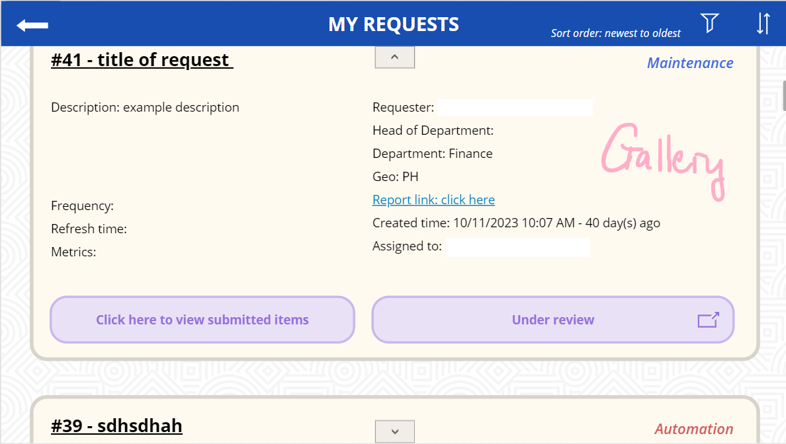

# **DATA REQUEST PORTAL**
- Developed using Power Apps.
- Provides a centralized platform to easily manage, view and track users' requests directed to the Data Department.
- Streamlines the process for submitting, monitoring and handling data requests from other departments.
> *Link:* 

## Types of Request
1. **Automation**
    - Create a new report as per the user's requirements.
2. **Maintenance**
    - Maintain or modify an existing report.
3. **Ad hoc** 
    - Custom requests for other specific tasks.

## User Capabilities
- **Submission**: 
    - Users fill in a strict form to submit new requests.
    - They can also attach files to their requests (*50MB* max per attachment, *10* attachments max).
    - Data team members can submit items (links, screenshots, files, ...) to their assigned requests when finished.
- **Viewing**:
    - Access a screen of all submitted requests and their statuses.
    - View full details of a request in another screen.
    - Sort by created time and filter requests by status.
    - Download attachments and review finished items submitted by data team members.
- **Request Management**:
    - Actions: approve, reject, assign, review, close, cancel.
    - Only Head of Department (HOD) and Data Manager (DM) can approve or reject requests.

## Portal Overview: [view here](portal_overview.pdf)


## SharePoint Lists

### Report Requests

Data (basically all users' requests) is stored in the "Report Requests" SharePoint list.

> *Link:*

**Report Requests list description:**

<sup>* = required. Using the form in PowerApps, other fields can also be set as required depending on the request type. </sup>


  **Column**            | **Description**                                                                                                                                             
------------------------|-------------------------------------------------------------------------------------------------------------------------------------------------------------
 **ID***                | Report ID.                      
 ****                   | Auto-generated                                                                                                                                              
 **Title***             | Singleline Text
 ****                   | Can be request title or report name.                                                                                                                      
 **Report Type***       | Choice                                                                                                                                                      
 ****                   | Type of report.                                                                                                                                             
 ****                   | Automation / Maintenance / Adhoc                                                                                                                            
 **Report Description** | Multiline Text
 ****                   | General description, reason, and purpose of the request.                                                                                                    
 **Report Link**        | Multiline Text
 ****                   | Link to the report that needs maintaining.                                                                                                                  
 **Metrics**            | Multiline Text
 ****                   | Metrics for automation request.                                                                                                                             
 **Frequency**          | Choice                                                                                                                                                      
 ****                   | Refresh frequency.                                                                                                                                          
 ****                   | Real time / Daily / Other                                                                                                                                 
 **Refresh Time**       | Datetime
 ****                   | Specified time or period to refresh.                                                                                                                        
 **Department**         | Choice                                                                                                                                                      
 ****                   | Name of department.                                                                                                                                         
 ****                   | Finance / BD / Sale / QA / CS / Logistics / IT / Data / Other                                                                                             
 **Head of Department***| Lookup                                                                                                                                                      
 ****                   | This column looks up another column in “Report Requests _ Head of Department” list (type: Person)                                                           
 **Geo**                | Choice                                                                                                                                                      
 ****                   | Country code.                                                                                                                                               
 ****                   | ALL / VN / TH / ID / PH / MY / Other                                                                                                                        
 **Created***           | Datetime                                                                                                                                                    
 ****                   | Auto-generated                                                                                                                                              
 ****                   | Time when the request was submitted.                                                                                                                        
 **Created By***        | Person                                                                                                                                                      
 ****                   | Auto-generated                                                                                                                                              
 ****                   | The “requester”                                                                                                                                             
 **Attachments**        | Boolean                                                                                                                                                     
 ****                   | YES if the request has attachment(s), NO if not                                                                                                             
 ****                   | User can attach report templates and other attachments.                                                                                                     
 **Status**             | Choice                                                                                                                                                      
 ****                   | Rejected by HOD / Rejected by Data Manager / Awaiting HOD’s response / Awaiting Data Manager’s response / In progress / Under review / Closed / Cancelled 
 **Assigned**           | Person                                                                                                                                                      
 ****                   | The person responsible for the request, assigned by DM.                                                                                                     
 **Notes**              | Singleline text                                                                                                                                             
 ****                   | Notes left by users.                                                                                                                                        
 **Finished Link**      | Multiline text                                                                                                                                              
 ****                   | Links to reports, screenshots, etc.                                                                                                                         
 **Estimated Deadline** | Datetime                                                                                                                                                    
 ****                   | Deadline after the request has been assigned to someone.                                                                                                    
 **Mandate**            | Text                                                                                                                                                        
 ****                   | Days given to finish the request.                                                                                                                           
### Report Requests _ Head of Department
> *Link:*

- Contains email of HODs in *"Email"* column.
- This column is referenced by *"Head of Department"* column in Report Requests list.
- In the request forms, these emails will appear in a dropdown menu for selection.

### Report Requests _ Data Team Members
> *Link:*

- The *"Member"* column is this list is of type 'Person'.
- Is used to verify whether current user is in Data team, as team members have more app privileges (view all requests, submit finished items, ...)

## **Request Status Flowchart**


 - **Flow of a request ticket:**
1. User fills in the request form and submits it.
2. The request is sent to their HOD for approval.
3. The HOD either approves or rejects the request.
4. If the request is approved, it is sent to DM for approval.
5. The DM either approves or rejects the request.
6. If the request is approved, DM sets a deadline and assigns a data team member.
7. The data team member works on the request.
8. The data team member either completes the request or cancels it.
9. If the request is completed, it is submitted and can be reviewed by the user and DM.
10. The Data Manager either cancels or closes the request.
11. User can still view closed requests and their attachments.

## **PowerBI Template**

**Report Requests list is used as data source**

Active requests: requests that are awaiting response, in progress or under review.


# App design

## Power Apps Studio
> *Documentation link: https://learn.microsoft.com/en-us/power-apps/maker/canvas-apps/power-apps-studio*

This link is enough to understand the basics of Power Apps Studio (basically where you edit the Portal).

## Naming Convention: 
A good practice for overall readability and understandability:
>[*See pages 5-11 in PowerApps canvas app coding standards and guidelines here*](naming_convention.pdf)

## Power Fx
Power Fx is the formula language for canvas apps in Power Apps.
> *Documentation link: https://learn.microsoft.com/en-us/power-platform/power-fx/overview*

## Connect to data


- Manage datasets in the "Data" tab
- To add a new SharePoint list:
    - Click on "Add data".
    - Seach for "SharePoint" and select it as data source.
    - Connect to the site that stores your lists.
    - Select the lists you want to add.

## Screens
Each screen should be named according to their use.


Use `Navigate(Screen Name, Transition Type)` to switch to another screen, example:
```
Navigate('Automation Screen', ScreenTransition.Fade);
```
## Properties
Screens, buttons, forms, etc. all have properties for you to edit.


## Buttons


Buttons are clickable, they have two important properties to note:
- **OnSelect**: 
    - When user presses a button, it will trigger the code in this property (see image above).
- **Visible**:
    - Can be either true (shown on screen) or false (hidden).
    - Can be used to hide buttons if certain criteria aren't met.
    - This is an easy way to set permissions for different users.
    - For example, if current user is HOD and this request is awaiting HOD's response, show this button:

```
If(ThisItem.'Head of Department'.Value = User().Email && ThisItem.Status.Value = "Awaiting HOD's response", true)
```
  

## Pop-ups
Using the **Visible property**, we can create pop-ups like this:


To create one:
1. Create your pop-up with shapes, text labels, buttons, ... as normal.
2. Select all of those, right click and select *"Group"*. This will create a group, which is the pop-up.
3. Change the group's Visible property to a variable, for example `varShowPopup`
4. You can now show / hide the pop-up by changing the value of this variable with any of these 2 functions:
```
Set(varShowPopup, true);
```
- SET creates a global variable which can be referenced on any screen (change this variable's value on all screens).
```
UpdateContext({varShowPopup: true});
```
- UPDATECONTEXT creates a local variable which can only be referenced from a single screen where it is initialized (change this variable's value only in this screen).

## Forms


- Three modes, can be changed in *"DefaultMode"* property: 
1. **FormMode.New**
    - Create a new record (request) in the list.
2. **FormMode.Edit**
    - Update fields of a record.
    - Use this mode to assign, submit, add notes, deadline, etc.
3. **FormMode.View**
    - Only show the request's fields (but looks very ugly). 
- **OnSuccess property**:
    - Only when the form is submitted successfully will this code run, as submission can fail (missing required fields, no user access, bad connectivity, etc.)
    - For example, change status of request to "In progress" and send email to requester after assigning succesfully: 
```
Patch(
    'Report Requests',
    LookUp('Report Requests', ID = galAllRequest.Selected.ID),
    {Status:{Value:"In progress"}}
);

Office365Outlook.SendEmailV2(
    galAllRequest.Selected.'Created By'.Email,
    "Request #"&galAllRequest.Selected.ID&" is now in progress",
    "Your request '"&galAllRequest.Selected.Title&"' has been assigned to: "&galAllRequest.Selected.Assigned.Email& " \\ Notes: "&galAllRequest.Selected.Notes
);
```    
### Cards


- A card is basically a field in the request.
- Each card has its own properties.
- **Required property**:
    - Set to true if you need users to fill in this field and vice versa.
    - Submission will fail if one or more required fields are blank.

## Galleries


- A gallery shows multiple records from a data source, so we use it to display requests that have been submitted.
- **Item property**:
    - Change this property to choose which requests to show.
    - Filter 'Report Requests' list by status (varFilterBy) and requests with current user's email in "Created By" or "Head of Department", then sort by ID ascending / descending (varSortDirection).
```
SortByColumns(
    Filter(
        'Report Requests',
        Switch(
            varFilterBy,
            "Awaiting", Status.Value = "Awaiting Data Manager's response" || Status.Value = "Awaiting HOD's response",
            "InProgress", Status.Value = "In progress",
            "UnderReview", Status.Value = "Under review",
            "Closed", Status.Value = "Closed",
            "RejectCancel", Status.Value = "Rejected by Data Manager" || Status.Value = "Cancelled" || Status.Value = "Rejected by HOD",
            true
        ) 
        && 
        If(
            'Head of Department'.Value = User().Email || 'Created By'.Email = User().Email,
            true,
            false
        )
    ),
    "ID",
    varSortDirection
)
```

## OnStart property
- App --> *"OnStart"* property
- Put the code you want to run when the Portal starts here, for example: setting default values for variables.
- Change Data Manager's email by editing varDataManager here.


## **Automated Email**
### Send email to HOD flow
> *Link to flow:*


- This Power Automate flow sends an email to HOD when user has successfully submitted a request.
- Other emails are sent using `Office365Outlook.SendEmailV2(To, Subject, Body)` in properties like OnSelect, OnSuccess (easier and more convenient, no need to create an entire flow).
    - To: specify email address
    - Subject: specify subject of email
    - Body: specify body of email
    - Example: 
    ```
    Office365Outlook.SendEmailV2(
        ThisItem.'Created By'.Email, 
        "Your request was rejected", 
        "Visit Portal to view"
    );
    ```

## Save, publish & version
- **Save:** save changes you've made to the Portal, but this new version isn't available for end-users yet.
- **Publish:** save and publish the current version of the Portal, end-users can now use this newly published version .
- Everytime you save or publish, it will create a new version for the Portal. <u>**You can revert back to previous versions if necessary.**</u>
- To know which is the latest published version, go to *"App version history"* and look for the ***"Live"*** version.


